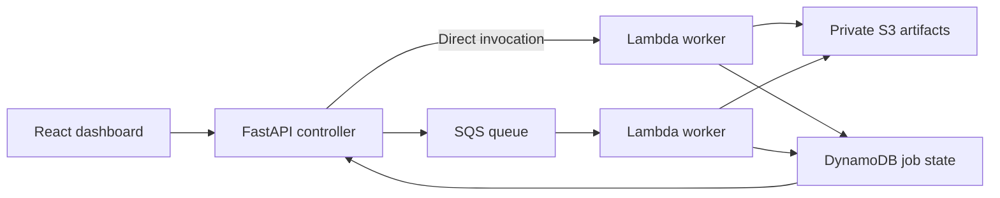

# BurstLab

**See how cloud systems respond when requests arrive faster than workers can process them.**

BurstLab compares direct Lambda invocation with SQS-backed processing through a visual dashboard. Both paths run the same QR-generation workload on AWS, making the tradeoffs between completion rate, waiting time, and retries visible.

## Watch the demo

[](https://www.youtube.com/watch?v=SPmKeS_lvI0)

**[▶ Watch BurstLab in action](https://www.youtube.com/watch?v=SPmKeS_lvI0)**

The walkthrough runs a traffic-burst experiment in AWS mode, then explores the deployed CloudFormation stack, Lambda functions, SQS queues, DynamoDB records, and a generated QR image in S3.

## Why I built it

I wanted to move beyond building features and understand how software behaves after deployment—when requests overlap, work backs up, or processing fails. BurstLab turns those behaviors into a repeatable experiment with visible outputs and recorded results. QR generation keeps the workload inexpensive and easy to verify while the focus stays on system design.

## Architecture



- **Controlled comparisons:** identical inputs, shared worker code, sequential trials, and matching application-level capacity limits.
- **Failure handling:** conditional job claims, expiring capacity permits, bounded retries, and SQS dead-letter configuration.
- **Visible evidence:** job timelines, QR previews, completion counts, latency metrics, saved runs, replay, and JSON/CSV exports.
- **Reproducible infrastructure:** AWS SAM/CloudFormation defines the workers, queues, storage, permissions, and CloudWatch logs.

The direct baseline has no caller retries; the queued path can retry. Injected delays and failures are explicit experiment settings. Results describe the tested configuration, not a general production-capacity benchmark.

**Stack:** React · TypeScript · Python · FastAPI · boto3 · Lambda · SQS · DynamoDB · S3 · CloudWatch · AWS SAM/CloudFormation

## Run it

Requires Python 3.11+ and Node.js 20.19+ or a current Node 22/24 release.

```bash
bash scripts/dev.sh
```

Open **http://127.0.0.1:8000**. Follow the [AWS setup guide](docs/AWS_SETUP.md) to deploy and connect your stack. AWS is the default; a local demo is available under **Settings → Execution environment**. The dashboard and controller run on your computer, while AWS-mode jobs execute in the cloud.

Keep cloud experiments small and disable queue processing afterward; the setup guide includes the commands and cleanup steps.

```bash
# Backend and frontend unit tests
.venv/bin/python -m pytest tests -q
npm --prefix frontend test
```
